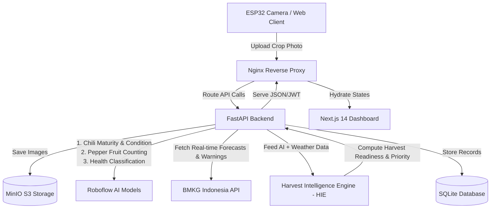

# TitikPanen - Regional Harvest Intelligence Platform

> **Submitted by:** Team **React kalo Agree**
> **Hackathon:** Garuda Hack 7.0 (2026)

TitikPanen is a premium, AI-powered Regional Harvest Intelligence Platform designed to optimize chili farming yield, mitigate plant disease risks, and determine optimal harvest timing across Indonesian agricultural areas. By combining multi-model AI computer vision (powered by Roboflow), real-time weather feeds from the **Badan Meteorologi, Klimitologi, dan Geofisika (BMKG)** Indonesia, and an intelligent **Harvest Intelligence Engine (HIE)**, TitikPanen empowers farmers, agricultural cooperatives, and food authorities to make data-backed harvest decisions.

---

## Key Capabilities & Roles
TitikPanen supports a multi-stakeholder model to drive collaborative, data-driven agriculture:

*   **Farmer (Petani)**:
    *   Monitor own crop health stats (ripeness, fruit count estimates, disease alerts).
    *   Instant AI Camera Analysis via quick drag-and-drop crop photo upload.
    *   View real-time BMKG weather forecasts and tailored harvesting advisories.
*   **Cooperative (Koperasi Tani)**:
    *   Oversee all member crop fields on a regional interactive map.
    *   Sort and filter harvesting priorities (HIGH / MEDIUM / LOW) to schedule logistics.
    *   Access aggregate yields and crop variety analytics.
*   **Food Authority (Dinas Pertanian)**:
    *   Monitor regional crop maturity and food security metrics.
    *   Detect disease hotspots (e.g. Anthracnose, Leaf Spot) through interactive mapping.
    *   View national BMKG weather warnings to deploy localized support.

---

## System Architecture



---

## Core Technologies & Multi-Model AI Pipeline

### 1. Multi-Model AI Pipeline (Roboflow)
Every uploaded crop photo is fed into three specialized computer vision models via the Roboflow Inference API:
1.  **Chili Maturity & Condition Dataset**: Inspects leaf quality and identifies disease infections (e.g., Anthracnose, Powdery Mildew, Leaf Spots).
2.  **Pepper Fruit Counting**: Uses object detection to locate and count individual chilies to estimate harvest volume.
3.  **Health Classification**: Evaluates the overall vegetation health score of the chili plant.

### 2. BMKG Weather Syncing
TitikPanen queries BMKG's API using the farm's exact latitude and longitude coordinates.
*   **Auto-Refresh Logic**: The weather data is checked against the database. If the cached record is older than 2 minutes, the backend automatically triggers a new request to BMKG (or generates stable mock weather if the BMKG server is offline) to keep dashboard statistics dynamically changing.

### 3. Harvest Intelligence Engine (HIE)
HIE is a rules-based engine that evaluates combined data points to output harvest readiness, risk assessments, and action advisories:
*   `Rule 1`: Harvest Readiness > 80% + Heavy Rain Warning → **Harvest Earlier** (Priority: **HIGH**). Prevents crop spoilage due to rain.
*   `Rule 2`: Harvest Readiness < 50% → **Continue Monitoring** (Priority: **LOW**). Plant needs more time to mature.
*   `Rule 3`: Disease Detected → **Disease Alert - Immediate Action Required** (Priority: **HIGH**). Isolates infected plants.
*   `Rule 4`: High Humidity (>90%) + Crop Infection → **Inspect Field Immediately** (Priority: **HIGH**). High moisture speeds up fungal spread.
*   `Rule 5`: Harvest Readiness > 70% + Sunny/Cloudy → **Ready for Harvest** (Priority: **MEDIUM**). Ideal picking conditions.

---

## Tech Stack
*   **Frontend**: Next.js 14, TailwindCSS, Leaflet.js (Interactive mapping), Recharts (Analytics and charts), Lucide Icons, Axios.
*   **Backend**: FastAPI (Python 3.11), SQLAlchemy, Uvicorn, Minio Python Client, SQLite.
*   **Infrastructure**: Docker, Docker Compose, Nginx Gateway Proxy.

---

## Quick Start Guide

### Prerequisites
*   Docker & Docker Compose installed on your local machine.

### Execution Steps
1.  **Clone the Repository**:
    ```bash
    git clone https://github.com/seipaa/team-reactkaloagree-GHQ7.0.git
    cd team-reactkaloagree-GHQ7.0
    ```
2.  **Run with Docker Compose**:
    ```bash
    # Build and start all containers
    docker compose up -d --build
    ```
3.  **Verify Running Containers**:
    ```bash
    docker compose ps
    ```

### Access Ports & Services
*   **Nginx Proxy Gateway (Recommended)**: [http://localhost:8080](http://localhost:8080)
    *   Dashboard Home: `/dashboard`
    *   Backend API documentation: `/api/docs`
*   **Direct Frontend**: [http://localhost:3001](http://localhost:3001)
*   **Direct Backend API**: [http://localhost:8000](http://localhost:8000)
*   **MinIO Console (S3 storage)**: [http://localhost:9001](http://localhost:9001) (Credentials: `minioadmin` / `minioadmin`)

---

## Demo Access Credentials
We have pre-seeded the SQLite database with multi-role accounts to show the system capabilities:

| Account Role | Email | Password | Scope |
|---|---|---|---|
| **Farmer (Pak Budi)** | `admin@agromesh.ai` | `admin123` | Lahan Pak Budi (Cianjur) |
| **Farmer (Siti)** | `petani@agromesh.ai` | `petani123` | Kebun Cabai Siti (Cianjur) |
| **Cooperative (Koperasi Tani)** | `koperasi@agromesh.ai` | `koperasi123` | All member crop fields |
| **Food Authority (Dinas Pertanian)** | `dinas@agromesh.ai` | `dinas123` | Regional mapping & weather warning |

---

## User & Data Flow Checklist
To run a full end-to-end demo of the platform:
1.  Go to [https://sterility-glimmer-fruit.ngrok-free.dev/](https://sterility-glimmer-fruit.ngrok-free.dev/) and log in as **Petani - Pak Budi** (`admin@agromesh.ai` / `admin123`).
2.  Browse your **Dashboard** to see current crop readiness, weather trends, and farm pins on the map.
3.  Go to **Daftar Lahan** and select **Lahan Cabai Pak Budi**.
4.  Click the **Analisis Foto Baru** button:
    *   Select or drop a crop picture from your computer.
    *   The file will **auto-upload and process instantly** without further confirmation.
    *   Read the **AI Analysis Report** summarizing crop ripeness, fruit estimate, disease flags, and HIE harvesting recommendation.
    *   Click **Selesai & Tutup** to dynamically refresh the farm's dashboard statistics.
5.  Log in as **Cooperative** (`koperasi@agromesh.ai`) to see all farm locations, filter urgent recommendations, and prioritize logistics.
6.  Open the **Analytics** page to inspect the multi-day **Weather Trend** (historical line chart of Suhu and Kelembaban).